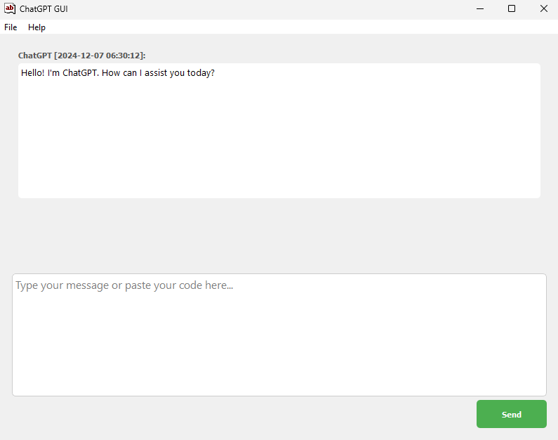

# ChatGPT GUI

**ChatGPT GUI** is a user-friendly desktop application that allows you to interact effortlessly with OpenAI's ChatGPT model.

## Table of Contents

- [Features](#features)
- [Demo](#demo)
- [Installation](#installation)
- [Configuration](#configuration)
- [Usage](#usage)
- [Session Management](#session-management)
- [Exporting Chats](#exporting-chats)
- [Logging](#logging)
- [Contributing](#contributing)
- [License](#license)
- [Acknowledgments](#acknowledgments)

## Features

- **Interactive Chat Interface**: Engage in real-time conversations with ChatGPT.
- **Session Management**: Save, load, and manage multiple chat sessions.
- **Rate Limiting**: Implements a token bucket algorithm to adhere to OpenAI's API rate limits.
- **Markdown Export**: Export your conversations as Markdown files for easy sharing and archiving.
- **Code Block Formatting**: Supports formatted code blocks within the chat for enhanced readability.
- **System Tray Integration**: Minimize the application to the system tray for easy access.
- **Graceful Shutdown**: Ensures sessions are saved upon exiting the application.
- **Comprehensive Logging**: Logs important events and errors for monitoring and debugging.

## Demo

*Screenshot of the ChatGPT GUI application in action.*

## Installation

Follow these steps to set up the ChatGPT GUI on your local machine.

### Prerequisites

- **Python 3.8 or higher**: Ensure you have Python installed. You can download it from [python.org](https://www.python.org/downloads/).

### Steps

1. **Clone the Repository**

   Use the following command to clone the repository and navigate into the project directory:

   `git clone https://github.com/yourusername/chatgpt-gui.git`  
   `cd chatgpt-gui`

2. **Create a Virtual Environment**

   It's recommended to use a virtual environment to manage dependencies:

   `python -m venv venv`

3. **Activate the Virtual Environment**

   - **Windows**:

     `venv\Scripts\activate`

   - **macOS and Linux**:

     `source venv/bin/activate`

4. **Install Dependencies**

   Install the required dependencies using pip:

   `pip install -r requirements.txt`

   If `requirements.txt` is not provided, install dependencies manually:

   `pip install PyQt5 openai tiktoken python-dotenv tenacity`

5. **Set Up Environment Variables**

   Create a `.env` file in the root directory of the project and add your OpenAI API key:

   `OPENAI_API_KEY=your_openai_api_key_here`

   Ensure that you replace `your_openai_api_key_here` with your actual OpenAI API key.

## Configuration

### Rate Limiting

The application uses a Token Bucket algorithm to manage API request rates, preventing exceeding OpenAI's rate limits.

- **Parameters**:
  - `rate_limit_max_calls`: Maximum number of API calls allowed within the period.
  - `rate_limit_period`: Time period (in seconds) for the rate limit.

- **Default Settings**:

  `handler = ChatGPTHandler(rate_limit_max_calls=60, rate_limit_period=60.0)`

  This configuration allows 60 API calls per 60 seconds.

- **Adjusting Rate Limits**:

  Modify these parameters based on your OpenAI subscription plan's rate limits.

### Model Configuration

By default, the application uses the `"o1-preview"` model with a high token limit. You can adjust the model and token limits in the `ChatGPTHandler` initialization:

`handler = ChatGPTHandler(
    model="o1-preview",
    max_context_tokens=128000,
    max_response_tokens=32768,
    rate_limit_max_calls=60,
    rate_limit_period=60.0
)`

Ensure that the model and token limits align with your OpenAI subscription and usage requirements.

## Usage

Launch the application using the following command:

`python main_gui.py`

Ensure that your virtual environment is activated before running the command.

### Sending Messages

- **Type Your Message**: Enter your query or message in the input field at the bottom of the application window.
- **Send Message**: Click the Send button or press Enter to submit your message.
- **View Response**: ChatGPT's response will appear in the chat area above.

## Session Management

Manage your chat sessions with ease.

### Saving a Session

- Navigate to the **File** menu.
- Select **Save Session**.
- Choose a location and filename to save your current session as a JSON file.

### Loading a Session

- Navigate to the **File** menu.
- Select **Load Session**.
- Browse and select a previously saved session JSON file to load your chat history.

## Exporting Chats

Export your conversations for sharing or archival purposes.

- Navigate to the **File** menu.
- Select **Export Chat as Markdown**.
- Choose a destination and filename to save your chat history as a Markdown (`.md`) file.

## Logging

All significant events and errors are logged to `chatgpt_handler.log` in the root directory. This log file is invaluable for monitoring application behavior and debugging issues.

## Contributing

Contributions are welcome! To contribute to ChatGPT GUI, please follow these guidelines:

1. **Fork the Repository**

   Click the Fork button at the top-right corner of the repository page.

2. **Create a New Branch**

   `git checkout -b feature/YourFeatureName`

3. **Make Your Changes**

   Implement your feature or bug fix.

4. **Commit Your Changes**

   `git commit -m "Add some feature"`

5. **Push to the Branch**

   `git push origin feature/YourFeatureName`

6. **Open a Pull Request**

   Navigate to the original repository and click **Compare & pull request**.

### Code of Conduct

Please adhere to the Code of Conduct when contributing to this project.

## License

This project is licensed under the MIT License.

## Acknowledgments

- **PyQt5**: For providing the GUI framework.
- **OpenAI**: For the powerful ChatGPT API.
- **tiktoken**: For efficient tokenization.
- **Tenacity**: For robust retry mechanisms.
- **python-dotenv**: For managing environment variables.

Developed by dagnazty.